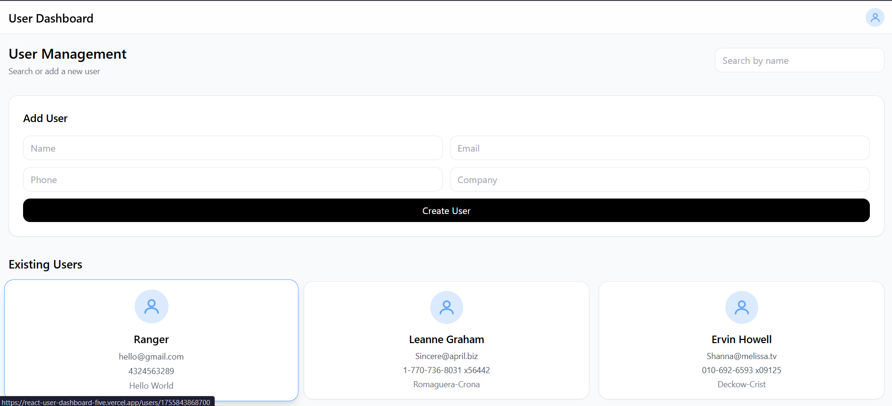
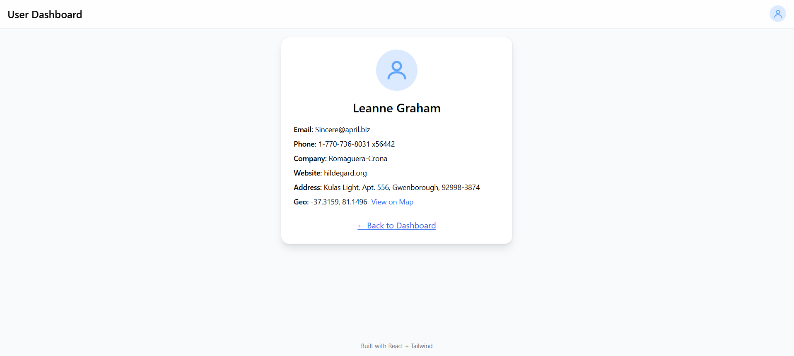

🖥️ React User Dashboard

A simple user dashboard built with React, Axios, React Router, and Tailwind CSS.

✨ Features

🔹 Fetch and display users from API

🔹 Search/filter users by name

🔹 Create new users (client-side only)

🔹 View user details including address and geo-location

🔹 Responsive design for mobile and desktop

📁 Project Structure

```
src/
 ├── api/                  # API utilities
 │    └── users.js
 │
 ├── assets/               # Static assets like images and logos
 │    └── react.svg
 │
 ├── components/           # Reusable UI components
 │    ├── CreateUserForm.jsx
 │    └── UserCard.jsx
 │
 ├── context/              # React Context for global state
 │    └── UserContext.jsx
 │
 ├── hooks/                # Custom React hooks
 │    └── useDebouncedValue.js
 │
 ├── pages/                # Application pages
 │    ├── DashboardPage.jsx
 │    └── UserDetailsPage.jsx
 │
 ├── App.jsx               # Root component with routes
 ├── App.css               # App-level styles
 ├── index.css             # Global styles
 └── main.jsx              # Entry point
```

⚡ Setup

```
git clone https://github.com/05Sourav/React_UserDashboard.git
cd React_UserDashboard
npm install
npm run dev
Open http://localhost:5173
 in your browser
```

🌐 Live Demo

Check out the live version of the dashboard hosted on Vercel:
https://react-user-dashboard-five.vercel.app/

🖼️ Screenshots

  
*Dashboard home page with user list*

  
*User details page showing address and geo-location*

🚀 Usage

🔹Browse the user list on the dashboard

🔹Use the search bar to filter users by name

🔹Click on a user card to see full details

🔹Use the "Create New User" form to add a user (client-side only)

💡 Future Improvements

🔹Add backend integration to persist created users

🔹Implement pagination for large user lists

🔹Add unit and integration tests

🔹Optionally migrate to Redux for more complex state management

🛠️ Tech Stack

🔹React (hooks) ⚛️

🔹Axios 🌐

🔹React Router DOM 🔀

🔹Tailwind CSS 🎨

📄 License

-> This project is licensed under the MIT License.